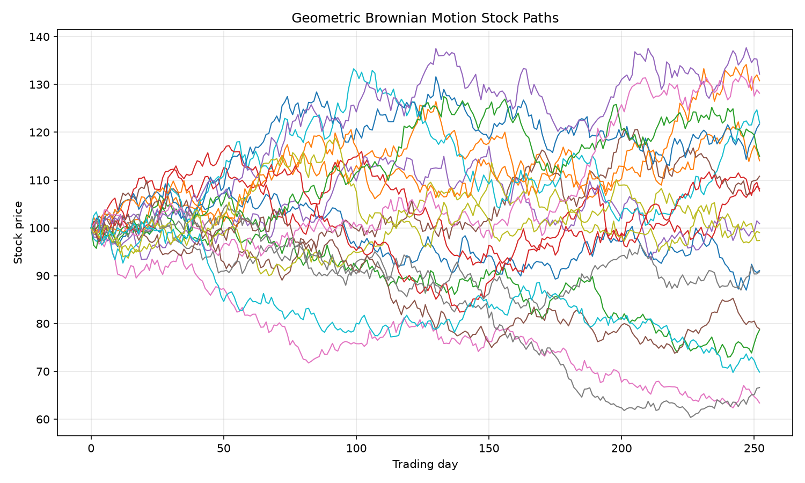
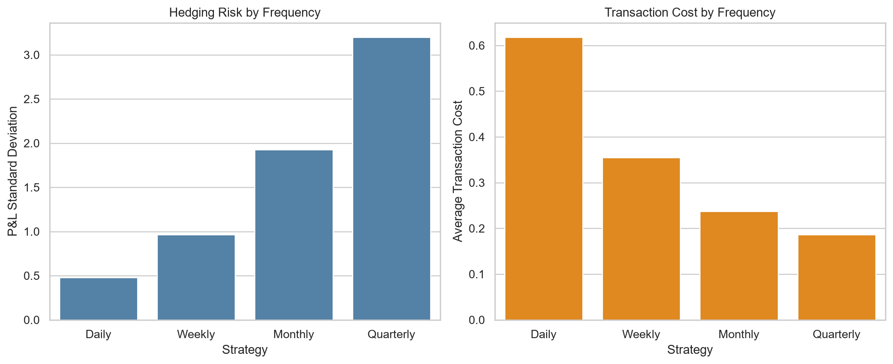
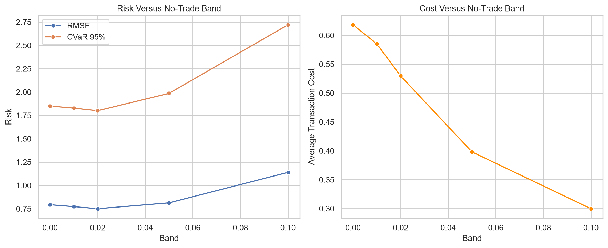
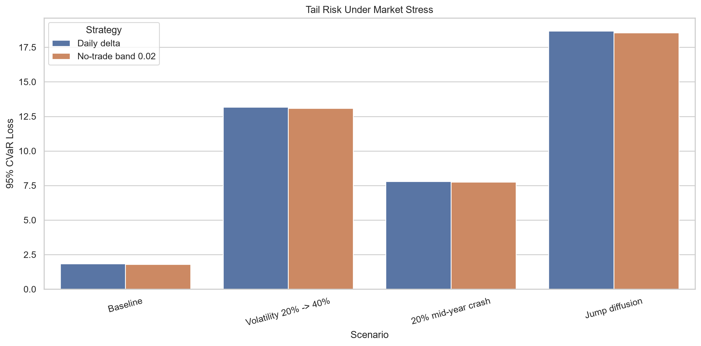
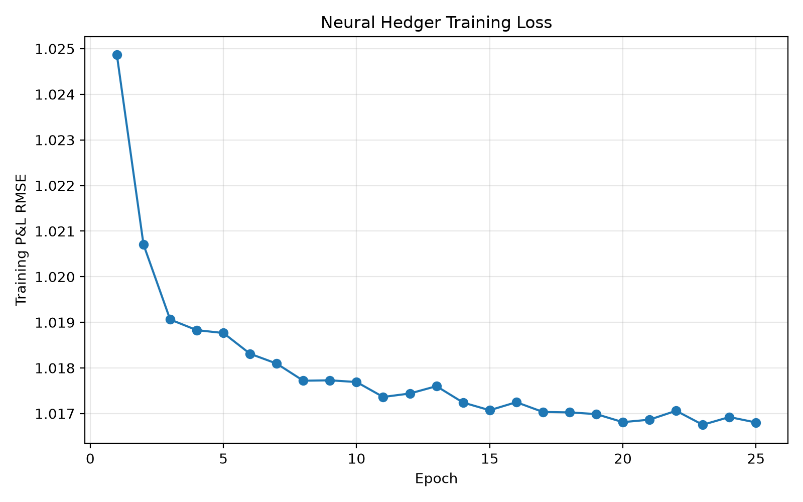
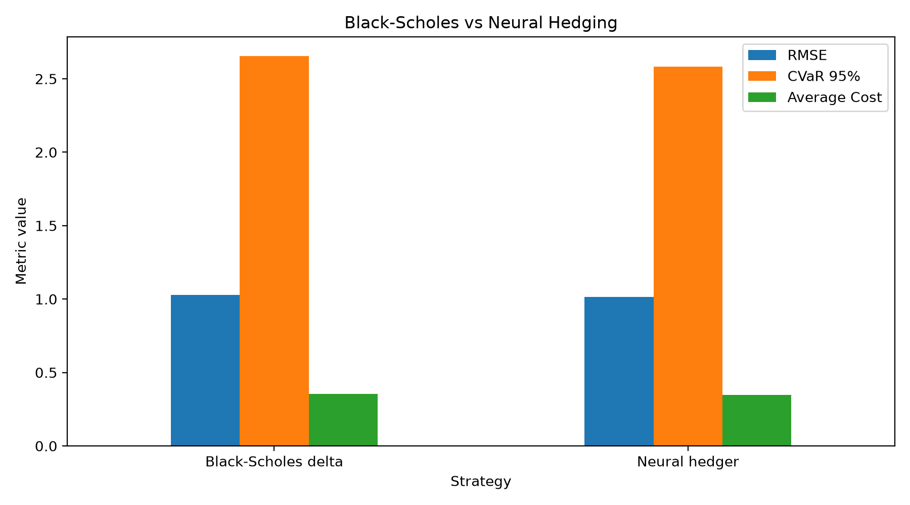
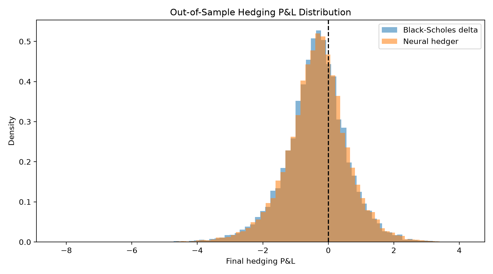
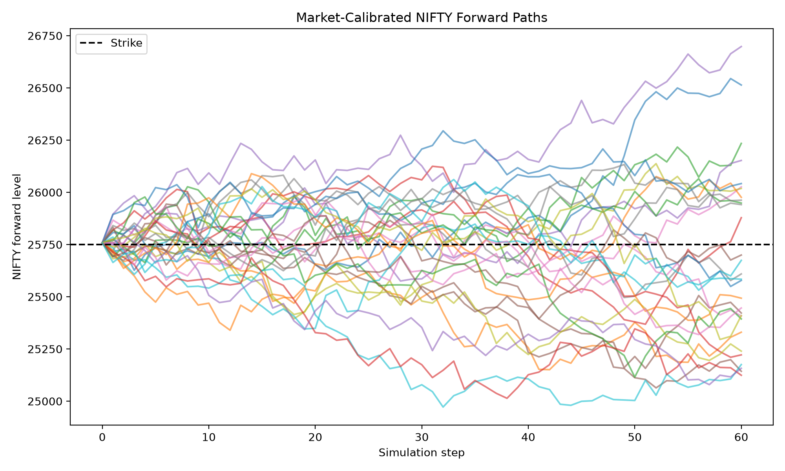
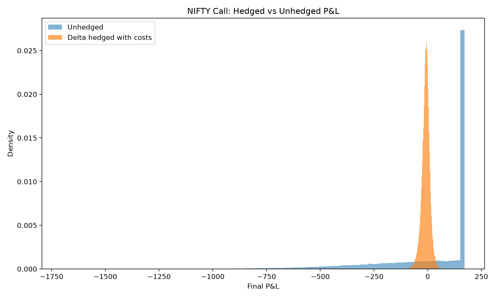

# Delta Hedging and Stock Path Simulation

A quantitative-finance simulator for studying European call-option hedging under transaction costs, discrete rebalancing, model mismatch, and stressed markets. The project compares analytical Black–Scholes delta hedging with a PyTorch neural hedger and includes a market-calibrated experiment using minute-level NIFTY option prices.

## Project overview

A call-option seller receives an upfront premium but may owe a large payoff if the underlying price rises. Delta hedging reduces this exposure by dynamically holding an offsetting position in the underlying asset.

The experimental pipeline is:

```text
Path generation → Option pricing → Delta calculation → Portfolio rebalancing
→ Transaction costs → Final P&L → Risk evaluation
```

## Features

- Vectorized Geometric Brownian Motion simulation
- Black–Scholes call pricing and delta
- Self-financing delta-hedging engine
- Transaction-cost and turnover modelling
- Daily, weekly, monthly, and quarterly rebalancing
- No-trade-band strategies
- VaR, CVaR, MAE, RMSE, and downside-risk evaluation
- Volatility shifts, market crashes, and Merton jump diffusion
- PyTorch neural hedger with GPU support
- Evaluation on unseen Monte Carlo paths
- Black–76 futures-option pricing and delta
- Calibration using minute-level NIFTY call and put prices
- 41 automated tests

## Financial model

### Call payoff

A European call option with strike $K$ has terminal payoff:

$$
\text{Call payoff}=\max(S_T-K,0)
$$

### Delta hedging

Delta measures the sensitivity of the option price $C$ to the underlying price $S$:

$$
\Delta=\frac{\partial C}{\partial S}
$$

A short call has negative option exposure. The seller therefore buys approximately $\Delta$ units of the underlying asset and periodically adjusts the position. More frequent rebalancing usually reduces discretization risk but increases transaction costs.

### Geometric Brownian Motion

Stock paths are simulated using:

$$
S_{t+\Delta t}
=
S_t\exp\left(
\left(\mu-\frac{\sigma^2}{2}\right)\Delta t
+
\sigma\sqrt{\Delta t}\,Z_t
\right)
$$

where:

- $S_t$ is the stock price at time $t$;
- $\mu$ is the expected annual return;
- $\sigma$ is annual volatility;
- $\Delta t$ is the time-step length;
- $Z_t\sim\mathcal{N}(0,1)$ is a standard normal random variable.

### Stress models

The simulator also evaluates hedging under:

- volatility regime changes;
- sudden market crashes;
- Merton jump diffusion.

These experiments show how hedging deteriorates when market behaviour differs from Black–Scholes assumptions.

## Baseline configuration and validation

The baseline Monte Carlo experiment uses:

| Parameter | Value |
|---|---:|
| Initial stock price | 100 |
| Strike | 100 |
| Expected annual return | 8% |
| Annual volatility | 20% |
| Risk-free rate | 5% |
| Maturity | 1 year |
| Trading steps | 252 |
| Simulated paths | 100,000 |

### Path-generation checks

| Check | Result |
|---|---:|
| Path-array shape | 100,000 × 253 |
| Minimum simulated price | 35.83 |
| Theoretical final mean | 108.33 |
| Simulated final mean | 108.37 |

The close agreement between the theoretical and simulated final means validates the GBM implementation.



### Option-pricing checks

| Metric | Result |
|---|---:|
| Average terminal call payoff | 13.15 |
| Maximum call payoff | 168.37 |
| Positive-payoff paths | 61.83% |
| Black–Scholes premium | 10.4506 |
| Initial call delta | 0.6368 |

The average simulated payoff is not equal to the Black–Scholes premium. The simulation uses a physical expected return of 8%, whereas Black–Scholes uses risk-neutral pricing and discounts the expected payoff.

## Classical hedging results

### Cost-free daily hedge

| Metric | Result |
|---|---:|
| Mean hedging error | 0.0004 |
| Error standard deviation | 0.4305 |
| Mean absolute error | 0.3198 |
| Worst shortfall | -3.1120 |
| Largest surplus | 2.4613 |

The near-zero mean error indicates that the self-financing hedge is approximately unbiased when the path and hedge models use matching assumptions.

### Hedged versus unhedged

| Metric | Unhedged | Daily delta hedge |
|---|---:|---:|
| P&L standard deviation | 16.9893 | 0.4305 |
| Worst shortfall | -157.3805 | -3.1120 |
| Simulated risk reduction | — | 97.47% |

With a proportional transaction-cost rate of 0.10%, daily hedging produced:

| Metric | Value |
|---|---:|
| Mean P&L | -0.6334 |
| P&L standard deviation | 0.4779 |
| Average transaction cost | 0.6183 |
| Average turnover | 618.3183 |
| Worst shortfall | -4.1045 |

The negative mean P&L is primarily caused by repeated transaction costs.

## Rebalancing-frequency trade-off

| Frequency | Mean P&L | P&L Std | RMSE | CVaR 95% | Average cost |
|---|---:|---:|---:|---:|---:|
| Daily | -0.6334 | 0.4779 | 0.7934 | 1.8509 | 0.6183 |
| Weekly | -0.3673 | 0.9648 | 1.0324 | 2.6734 | 0.3546 |
| Monthly | -0.2442 | 1.9264 | 1.9418 | 4.8316 | 0.2374 |
| Quarterly | -0.1955 | 3.2008 | 3.2068 | 7.9366 | 0.1859 |

Frequent hedging provides lower dispersion and tail risk, but creates greater turnover and cost.



## No-trade-band comparison

A no-trade band avoids rebalancing when the new target delta is sufficiently close to the current hedge.

| Band | Mean P&L | P&L Std | RMSE | CVaR 95% | Average cost |
|---|---:|---:|---:|---:|---:|
| 0.00 | -0.6334 | 0.4779 | 0.7934 | 1.8509 | 0.6183 |
| 0.01 | -0.6009 | 0.4863 | 0.7730 | 1.8280 | 0.5854 |
| 0.02 | -0.5469 | 0.5139 | 0.7505 | 1.8003 | 0.5297 |
| 0.05 | -0.4192 | 0.6972 | 0.8135 | 1.9861 | 0.3981 |
| 0.10 | -0.3322 | 1.0904 | 1.1399 | 2.7205 | 0.2997 |

In the baseline experiment, a band of 0.02 reduced average cost from 0.6183 to 0.5297 while improving RMSE from 0.7934 to 0.7505. Wider bands reduced cost further but allowed substantially more hedging risk.



## Stress testing

| Scenario | Strategy | Mean P&L | RMSE | CVaR 95% | Worst P&L |
|---|---|---:|---:|---:|---:|
| Baseline | Daily delta | -0.6334 | 0.7934 | 1.8509 | -4.1045 |
| Volatility 20% → 40% | Daily delta | -5.3543 | 6.3832 | 13.1822 | -21.5319 |
| 20% mid-year crash | Daily delta | -4.9520 | 5.2716 | 7.7863 | -10.6322 |
| Jump diffusion | Daily delta | -4.0951 | 6.3582 | 18.6901 | -49.0056 |

Jump diffusion produced the largest tail risk because the strategy cannot rebalance before an instantaneous price jump.



## Neural hedger

The PyTorch neural hedger receives:

- log-moneyness;
- normalized remaining time;
- previous hedge;
- Black–Scholes delta.

Instead of learning the entire strategy from scratch, it learns a bounded correction around the analytical Black–Scholes delta. The model was trained on 20,000 simulated paths by minimizing terminal P&L mean squared error while accounting for transaction costs.

### Evaluation on unseen paths

| Strategy | Mean P&L | P&L Std | RMSE | CVaR 95% | Average cost | Worst P&L |
|---|---:|---:|---:|---:|---:|---:|
| Black–Scholes delta | -0.3729 | 0.9579 | 1.0279 | 2.6540 | 0.3547 | -8.2888 |
| Neural hedger | -0.3458 | 0.9537 | 1.0144 | 2.5832 | 0.3479 | -7.9828 |

On 20,000 unseen paths, the neural hedger achieved:

- 1.31% lower RMSE;
- 2.67% lower CVaR;
- 1.92% lower average transaction cost.

The improvement is reported as modest because Black–Scholes already provides a strong analytical baseline.







## Market-calibrated NIFTY experiment

Minute-level NIFTY option data was used to calibrate a realistic synthetic experiment. The selected call is the 25,750-strike contract observed at 11:00 AM on 4 February 2026.

| Parameter | Value |
|---|---:|
| Contract | NIFTY 25,750 call |
| Expiry | 10 February 2026 |
| Market call premium | 170.45 |
| Parity-implied forward | 25,758.49 |
| Remaining maturity | 6.1875 days |
| Implied volatility | 12.43% |
| Initial Black–76 delta | 0.5109 |

The matching put is used only to infer the option-expiry forward through European put–call parity:

$$
F=K+e^{rT}(C-P)
$$

Black–76 implied volatility is then solved numerically so that the model reproduces the observed call premium.

### NIFTY-calibrated results

| Strategy | Mean P&L | P&L Std | RMSE | CVaR 95% | Worst P&L | Average cost |
|---|---:|---:|---:|---:|---:|---:|
| Unhedged short call | -0.0762 | 248.4489 | 248.4489 | 708.9198 | -1701.2012 | 0.0000 |
| Black–76 delta | -0.0720 | 18.4865 | 18.4867 | 42.9731 | -137.1592 | 0.0000 |
| Black–76 delta with costs | -9.0072 | 18.9431 | 20.9755 | 54.7868 | -150.6159 | 8.9315 |

The cost-free Black–76 hedge reduced simulated P&L standard deviation by approximately 92.56%. Transaction costs shifted the mean P&L downward but the hedged portfolio retained substantially lower dispersion and tail risk than the unhedged position.

The model premium equals the observed premium because implied volatility was calibrated to reproduce that market price. This is calibration, not an independent price prediction. Real prices determine the initial conditions; subsequent paths remain synthetic, so this experiment is not presented as a historical backtest.





## Complete generated results

- [Rebalancing-frequency results](results/frequency_comparison.csv)
- [No-trade-band results](results/band_comparison.csv)
- [Stress-testing results](results/stress_comparison.csv)
- [Neural-hedger comparison](results/neural_comparison.csv)
- [NIFTY-calibrated results](results/nifty_calibrated_summary.csv)

## Project structure

```text
.
├── data/raw/                         # NIFTY minute-price CSV files
├── results/                          # Tables, plots, and trained model
├── src/
│   ├── data/                         # Market-data loading and parsing
│   ├── evaluation/                   # Risk metrics
│   ├── hedging/                      # Classical and neural hedge engines
│   ├── options/                      # Option payoff functions
│   ├── pricing/                      # Black–Scholes and Black–76
│   ├── simulation/                   # GBM, stress, and jump models
│   └── visualization/                # Plotting utilities
├── tests/                            # Automated unit tests
├── run_experiment.py                 # Classical and stress experiments
├── run_nifty_calibrated_experiment.py
├── train_neural_hedger.py
├── evaluate_neural_hedger.py
└── requirements.txt
```

## Installation

Create and activate a virtual environment on Windows PowerShell:

```powershell
py -m venv .venv
Set-ExecutionPolicy -Scope Process -ExecutionPolicy Bypass
.\.venv\Scripts\Activate.ps1
```

Install the dependencies:

```powershell
python -m pip install --upgrade pip
pip install -r requirements.txt
```

## Running the project

Run the complete classical simulation and stress suite:

```powershell
python run_experiment.py
```

Run the NIFTY-calibrated experiment:

```powershell
python run_nifty_calibrated_experiment.py
```

Train and evaluate the neural hedger:

```powershell
python train_neural_hedger.py
python evaluate_neural_hedger.py
```

Run all automated tests:

```powershell
python -m pytest -q
```

Expected result:

```text
41 passed
```

## Interpretation of risk metrics

- **P&L standard deviation:** overall variability of hedging outcomes.
- **MAE:** average absolute distance of P&L from zero.
- **RMSE:** penalizes large hedging errors more heavily than MAE.
- **VaR 95%:** loss threshold exceeded in approximately 5% of simulations.
- **CVaR 95%:** average loss among the worst 5% of simulations.
- **Turnover:** total value traded while adjusting the hedge.

Lower RMSE and CVaR indicate a more effective hedge, while lower turnover and transaction costs indicate a less expensive strategy.

## Limitations

- Simulated paths cannot reproduce every feature of real markets.
- Black–Scholes and Black–76 assume constant volatility and continuous price dynamics.
- Transaction costs use a simplified proportional-cost model.
- Bid–ask spreads, slippage, margin requirements, and liquidity constraints are omitted.
- The neural hedger was evaluated on synthetic unseen paths rather than extensive historical option data.
- The NIFTY dataset is used for calibration, not as evidence of long-term historical profitability.
- Only European call-option hedging is implemented.
- The software is an educational simulator, not a live trading or investment system.

## Technologies

Python, NumPy, Pandas, SciPy, Matplotlib, Seaborn, PyTorch, and Pytest.
